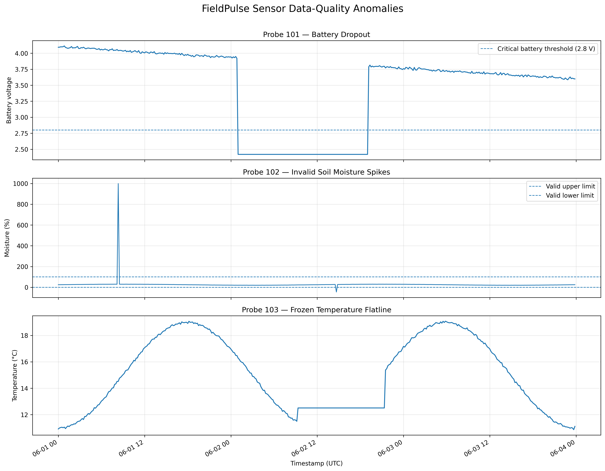

# Project FieldPulse — Agritech Sensor Data Quality Pipeline


## Overview

Project FieldPulse is a PostgreSQL-based data-quality pipeline for unreliable farm sensor telemetry.

The project uses a simulated agritech dataset to show how raw IoT-style field readings can be imported, preserved, validated, cleaned, flagged, and summarised into a reusable analytical layer for safer downstream analysis.

## Problem

Farm sensor data can contain misleading or unreliable readings caused by sensor faults, battery failure, transmission issues, or cached/frozen device values.

If these problems are not identified, later analysis may treat unreliable readings as real soil or environmental behaviour.

This project focuses on three common telemetry data-quality issues:

1. Physically impossible soil moisture values

2. Battery-related missing temperature and moisture readings

3. Frozen temperature sensor behaviour caused by repeated identical values


## Repository Structure

```text
Fieldpulse-agritech-sensor-quality/
├── README.md
├── requirements.txt
├── data/
│   └── dirty_farm_sensors.csv
├── docs/
│   └── investigation_notes.md
├── outputs/
│   ├── probe_quality_summary.csv
│   ├── qa_summary.csv
│   └── sensor_anomalies.png
├── scripts/
│   └── generate_data.py
└── sql/
    ├── 01_create_staging.sql
    ├── 02_load_data.sql
    ├── 03_create_clean_view.sql
    └── 04_qa_summary.sql
```

## Project Files

| File | Purpose |
|---|---|
| `data/dirty_farm_sensors.csv` | Simulated farm sensor telemetry |
| `scripts/generate_data.py` | Generates the simulated dataset |
| `sql/01_create_staging.sql` | Creates the staging table and probe/time index |
| `sql/02_load_data.sql` | Imports the telemetry data into the staging table |
| `sql/03_create_clean_view.sql` | Creates the reusable analytical view with data-quality rules and diagnostic flags |
| `sql/04_qa_summary.sql` | Produces dataset-level and probe-level QA summaries |
| `outputs/sensor_anomalies.png` | Visualises the simulated telemetry anomalies |
| `docs/investigation_notes.md` | Investigation log and analytical reasoning |

## Pipeline

```text
PostgreSQL database
        │
        ▼
01_create_staging.sql
Creates the staging table and index.
        │
        ▼
02_load_data.sql
Imports dirty_farm_sensors.csv.
        │
        ▼
03_create_clean_view.sql
Creates the reusable analytical view.
        │
        ▼
04_qa_summary.sql
Produces dataset-level and probe-level QA summaries.
```

## Dataset

The dataset contains simulated telemetry from three farm probes over three days.

Each probe reports readings every 10 minutes.

| Item | Value |
|---|---:|
| Total rows | 1,296 |
| Probes | 3 |
| Rows per probe | 432 |
| Time range | 2026-06-01 to 2026-06-03 |
| Reading frequency | Every 10 minutes |

### Main fields

| Column | Description |
|---|---|
| `probe_id` | Sensor/probe identifier |
| `timestamp_utc` | Timestamp of reading |
| `raw_moisture_pct` | Raw soil moisture percentage |
| `raw_temp_c` | Raw temperature in Celsius |
| `battery_v` | Sensor battery voltage |

## Tools Used

- PostgreSQL 18
- SQL
- psql
- Python
- pandas
- Matplotlib
- Git
- GitHub

## Database Design

The project uses two main database objects:

| Object | Purpose |
|---|---|
| `staging_farm_telemetry` | Raw imported telemetry table |
| `vw_clean_farm_telemetry` | Reusable clean analytical view with data-quality flags |

The raw staging table is preserved as the evidence layer.

The clean view provides the analytical layer used for downstream queries.


## Data-Quality Rules

### 1. Impossible soil moisture

Soil moisture percentage should sit between `0` and `100`.

Readings outside this range are treated as invalid and converted to `NULL` in the cleaned field.

```sql
CASE 
    WHEN raw_moisture_pct < 0 
      OR raw_moisture_pct > 100 
    THEN NULL
    ELSE raw_moisture_pct
END AS clean_moisture_pct
```

### 2. Battery dropout

Rows are flagged as battery dropout when the battery voltage is critically low and both environmental readings are missing.

```sql
CASE
    WHEN battery_v < 2.8
     AND raw_moisture_pct IS NULL
     AND raw_temp_c IS NULL
    THEN TRUE
    ELSE FALSE
END AS battery_dropout_flag
```

### 3. Frozen temperature sensor

Frozen temperature behaviour is detected by identifying long consecutive runs of identical temperature readings.

For this project, a frozen-temperature candidate is defined as:

* the same `raw_temp_c` value repeated consecutively
* for at least 12 readings
* equivalent to 2 hours of 10-minute sensor readings

This uses SQL window functions including `LAG()` and a running `SUM()` to assign each consecutive temperature streak a run ID.

## Final Results

### Overall data-quality summary

| total_rows | invalid_moisture_rows | battery_dropout_rows | frozen_temp_rows |
|---:|---:|---:|---:|
| 1296 | 2 | 109 | 73 |

### Summary by probe

| probe_id | total_rows | invalid_moisture_rows | battery_dropout_rows | frozen_temp_rows |
|---:|---:|---:|---:|---:|
| 101 | 432 | 0 | 109 | 0 |
| 102 | 432 | 2 | 0 | 0 |
| 103 | 432 | 0 | 0 | 73 |

## Sensor Anomaly Visualisation

The figure below visualises the three simulated telemetry-quality issues represented in the dataset.

- Probe 101 shows battery voltage falling below the operational threshold.

- Probe 102 contains physically impossible soil moisture readings.

- Probe 103 demonstrates a frozen temperature sensor producing repeated identical values.



## Interpretation

The clean analytical view correctly identifies the three injected telemetry-quality scenarios.

- Probe 101 had 109 rows affected by battery dropout.
- Probe 102 had 2 physically impossible soil moisture readings.
- Probe 103 had 73 rows affected by a frozen temperature flatline.

Each probe represents a different class of telemetry problem:

| Probe | Issue | Type of problem |
|---:|---|---|
| 101 | Battery dropout | Missingness caused by device failure |
| 102 | Invalid moisture readings | Physically impossible values |
| 103 | Frozen temperature readings | Sequence-based sensor anomaly |

## Key Learning

The strongest part of the project is the frozen-sensor detection.

A single temperature reading of `12.50°C` is not suspicious by itself. However, `12.50°C` repeated continuously for 73 consecutive 10-minute readings is suspicious.

This shows that some sensor anomalies cannot be detected by individual observations alone. They only become visible when readings are evaluated in their temporal sequence.

## Requirements

### Database

- PostgreSQL 18+

### Python

Install the Python dependencies:

```bash
pip install -r requirements.txt
```

## How to Run the Project

### 1. Create the staging table

```bash
psql -d project_fieldpulse -f sql/01_create_staging.sql
```

### 2. Load the telemetry data

```bash
psql -d project_fieldpulse -f sql/02_load_data.sql
```

### 3. Create the analytical view

```bash
psql -d project_fieldpulse -f sql/03_create_clean_view.sql
```

### 4. Generate QA summaries

```bash
psql -d project_fieldpulse -f sql/04_qa_summary.sql
```

Running the SQL files in sequence will:

1. Drop and recreate the staging table
2. Import the raw CSV
3. Create the clean telemetry view
4. Apply data-quality rules
5. Return final QA summary results

Expected output includes:

```text
total_rows | invalid_moisture_rows | battery_dropout_rows | frozen_temp_rows
1296       | 2                     | 109                  | 73
```


## Limitations

This project uses a simulated dataset.

The project does not include:

- live sensor ingestion
- cloud deployment
- automated testing
- dashboarding
- real farm hardware integration
- production orchestration

In a production system, the same principles could be extended using scheduled pipelines, dbt models, sensor-health tables, automated QA tests, and dashboard monitoring.

## Conclusion

FieldPulse implements a PostgreSQL data-quality workflow for agricultural sensor telemetry.

The pipeline preserves raw telemetry, applies validation rules, detects temporal sensor anomalies, and exposes a reusable analytical view for downstream analysis. While the dataset is simulated, the workflow reflects the stages commonly required when preparing sensor telemetry for reliable analysis.
